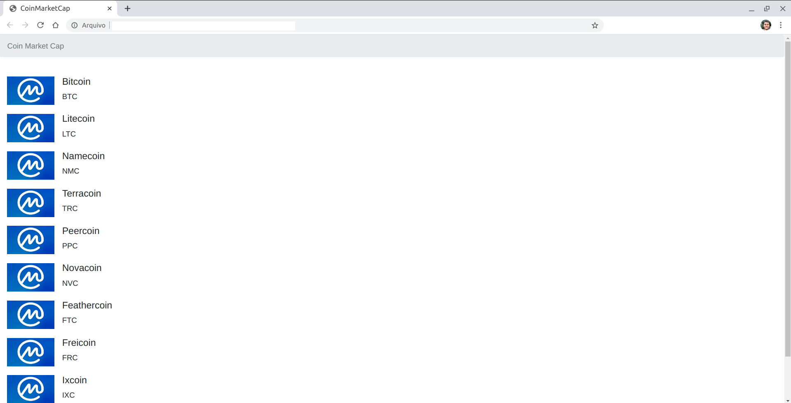

<h1 align="center"> Web Project using API Coin Market Cap</h1>

It is a page to request crypto currencies data from CoinMarketCap API, following the Everis FullStack Bootcamp (DIO) lessons!

  Before 

  After 

### The goals of this project were:
- to make an API request, using CoinMarketCap API for the first time.
- to work with the values of this API
- to display the data on a web page

### Customizations made were:
- Import logo images of each crypto coin.
- New requests of Ranking, and the first historical customized.
- Coinmarketcap tab icon added.
- The layout was whole changed, the content is ordered by a table.
	

### Useful API links in Coin Market Cap  
[Portal do desenvolvedor](https://pro.coinmarketcap.com/account)  
[Documetação de autenticação](https://coinmarketcap.com/api/documentation/v1/#section/Authentication)  
[Documentação API](https://coinmarketcap.com/api/documentation/v1/#)  
